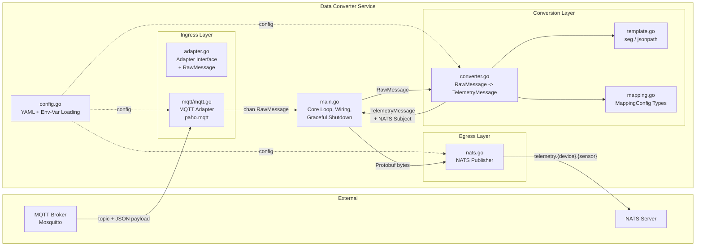
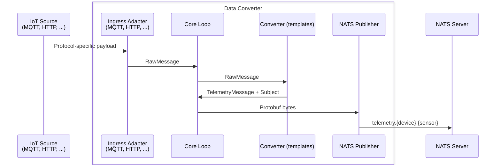

# Data Converter — Architecture

## Overview

The Data Converter receives telemetry data from external IoT protocols, converts it into the Nexus Protobuf format (`TelemetryMessage`), and publishes it to NATS.
The service is protocol-agnostic by design — new ingress protocols can be added without modifying the conversion or egress layer.

## Layers

### Configuration (`config.go`)

Loads a YAML config file at startup.
The config defines which adapters to use, how to subscribe, and how to map incoming payloads to `TelemetryMessage` fields.
Environment variables are interpolated via `${VAR_NAME}` syntax, so secrets never live in the config file.

### Ingress Layer (`ingress/`)

Defines the `Adapter` interface that all protocol adapters implement:

- `Start(ctx)` - connect and begin consuming
- `Stop(ctx)` - graceful disconnect
- `Messages()` - returns a `<-chan RawMessage`

Each adapter pushes `RawMessage` structs (source, topic, raw bytes, metadata) into a buffered channel.
The buffer acts as backpressure — when full, the oldest message is dropped and logged.

Currently, an **MQTT Adapter** (`ingress/mqtt/mqtt.go`) is provided.
It uses `paho.mqtt.golang` with auto-reconnect and subscribes to topics defined in the config.

### Conversion Layer (`transform/`)

Converts a `RawMessage` into a `TelemetryMessage` using YAML-defined mappings.

- **`transformer.go`** — the `Converter` parses the JSON payload, builds a template context (`topic`, `topic_segments`, `payload`), executes Go `text/template` expressions from the mapping config, and assembles the Protobuf message.
- **`template.go`** — provides two custom template functions:
  - `seg(topic, index)` — extracts a segment from a `/`-delimited topic
  - `jsonpath(payload, path)` — extracts a value from the JSON payload by dot-path
- **`mapping.go`** — defines the config types (`MappingConfig`, `SensorMapping`, `TargetConfig`, `ConverterDef`)

Best-effort validation: missing fields log a warning but don't drop the message.

### Egress Layer (`egress/`)

Publishes serialized Protobuf bytes to NATS.
The NATS subject is derived from the mapping config's `subject_pattern` template (e.g. `telemetry.{device_id}.{sensor}`).
Connects with infinite reconnect (`MaxReconnects(-1)`).

### Core Loop (`main.go`)

Wires all layers together:

1. Load config, create logger
2. Connect NATS publisher
3. Build converters from config
4. Start adapters
5. Loop: read from adapter channel → convert → serialize Protobuf → publish to NATS
6. On `SIGINT`/`SIGTERM`: graceful shutdown of adapter and publisher

## Data Flow

