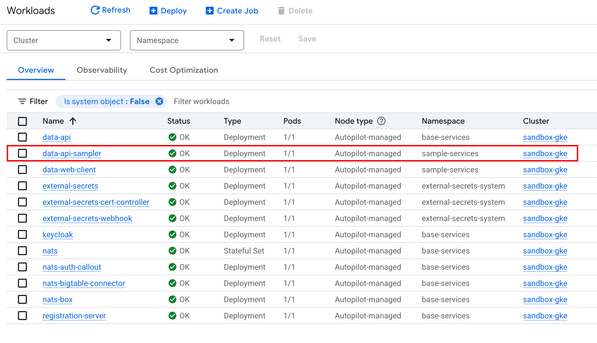
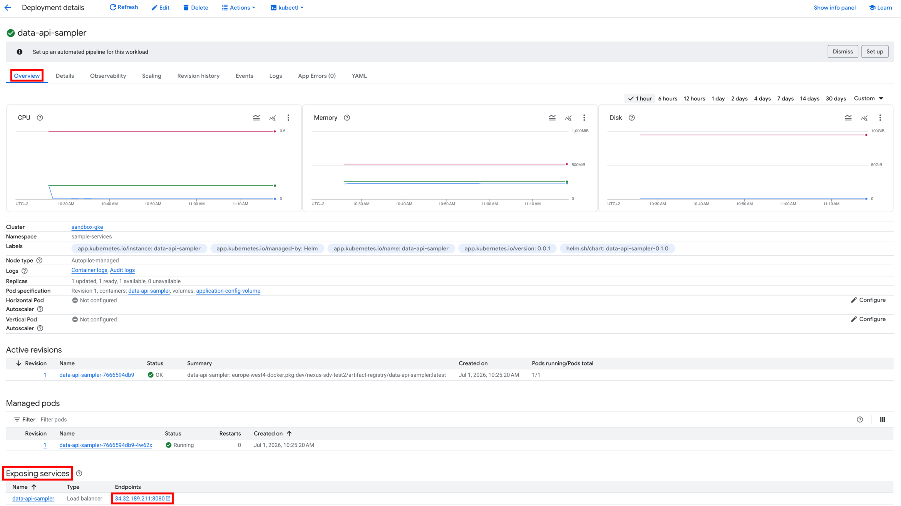

## 🎯 Getting Started

This guide assumes that the Nexus platform has been successfully deployed and that both sample clients have ingested data, as covered in the previous guides. We will demonstrate how to retrieve this data using the **Nexus Data API**.

:::note[Leveraging BigTable in Google Cloud]
As covered in the Clients Getting Started guide, data is ingested through the NATS broker into a BigTable instance's table called `telemetry`. While the simplest way to access this data is via native GCP tools like **BigTable Studio, BigQuery, Vertex AI, or Looker**, this guide focuses on an abstracted, generic approach: writing applications that leverage ingested telemetry data via an API layer.
:::

To continue with this guide, follow these steps:

<Steps>

1. **Deploy the Data API Sampler**
   We provide a sample Nexus application that is not part of the base services. You will need to deploy this component manually to your environment.

2. **Request Data via REST**
   Our examples utilize **curl**, though you can use any preferred REST client (e.g., Postman or Insomnia) to interact with the API.

</Steps>

## Deploy the Data API Sampler

:::note[GCP Cloud Build deployment]
If the platform was deployed as recommended using GCP Cloud Build, the data-api-sampler is already deployed and you can skip to the next section.
:::

The sampler ships with its own Cloud Build pipeline, `iac/cloudbuild/build-push-deploy-data-api-sampler.yaml`. Submit that pipeline against the project your platform runs in to deploy or redeploy the service.

### Check Deployment Success

Once the pipeline has completed, verify that the service was successfully deployed. You can find it in the **Google Cloud Console** under the **GKE Workloads** screen.



The service is deployed within a dedicated namespace called `sample-services`, keeping it isolated from the Nexus SDV `base-services`. 

### Retrieve Service Endpoint
The Data API Sampler is cluster-internal. From your workstation you reach it through a port forward, which needs the cluster credentials:

```bash
gcloud container clusters get-credentials <ENV>-gke --region <REGION> --project <PROJECT_ID> --dns-endpoint
kubectl port-forward -n sample-services svc/data-api-sampler 8080:8080
```

Keep the port forward running in its own terminal. The service then answers on `http://localhost:8080`; the port forward itself is encrypted from your workstation to the pod.

:::note[Telemetry needs a token]
The sampler reads vehicle telemetry, so it does not answer anonymous requests. Every call to `/data/**` needs a Keycloak access token carrying the `factory-operator` realm role of the Factory Helper client. Only `/health` is open, because the kubelet has no token.

```bash
TOKEN=$(curl -s \
  -d grant_type=client_credentials -d client_id=factory-operator \
  -d client_secret="$(gcloud secrets versions access latest \
    --secret=FACTORY_OPERATOR_CLIENT_SECRET --project=<PROJECT_ID>)" \
  https://keycloak-ui.<BASE_DOMAIN>/realms/sdv-telemetry/protocol/openid-connect/token \
  | jq -r .access_token)
```
:::



## Request Data via REST
Now it is time to test the Data API Sampler. Run the following command and remember to **replace the IP with your specific service endpoint**:

```bash
$ curl http://localhost:8080/health | jq 
{
  "groups": [
    "liveness",
    "readiness"
  ],
  "status": "UP"
}
```

To request data a different URL is needed: `http://localhost:8080/data/<VIN>/datatypes/<DATATYPE>:<PROPERTY_ID>?lookback=<LOOKBACK_TIME>`
* `VIN` is used to identify the car
* `DATATYPE` specifies whether a static or a dynamic property is requested
* `PROPERTY_ID` specifies the exact property to retrieve
* `LOOKBACK_TIME` specifies the timespan to look back for data.

You can use these commands to retrieve the data transmitted by the **Go client**:
```bash
$ curl -H "Authorization: Bearer $TOKEN" http://localhost:8080/data/VEHICLE001/datatypes/dynamic:battery.temp | jq 
{
  "dynamic:battery.temp": [
    "\"25.15\""
  ]
}
```

```bash
$ curl -H "Authorization: Bearer $TOKEN" "http://localhost:8080/data/VEHICLE001/datatypes/dynamic:battery.temp?lookback=1d" | jq 
{
  "dynamic:battery.temp": [
    "\"24.81\"",
    "\"25.24\"",
    "\"25.08\"",
    "\"25.30\"",
    "\"25.16\"",
    "\"25.05\"",
    "\"25.00\"",
    "\"25.29\"",
    "\"25.15\""
  ]
}
```

To retrieve data transmitted by the **Python client**, the request needs to be slightly modified:
```bash
$ curl -H "Authorization: Bearer $TOKEN" "http://localhost:8080/data/VEHICLE001/datatypes/static:index?lookback=1d" | jq
{
  "static:index": [
    "\"0\"",
    "\"1\"",
    "\"2\"",
    "\"3\"",
    "\"4\"",
    "\"5\"",
    "\"6\""
  ]
}
```

```bash
$ curl -H "Authorization: Bearer $TOKEN" "http://localhost:8080/data/VEHICLE001/datatypes/static:test_key?lookback=1d" | jq
{
  "static:test_key": [
    "\"test_value\"",
    "\"test_value\"",
    "\"test_value\"",
    "\"test_value\"",
    "\"test_value\"",
    "\"test_value\"",
    "\"test_value\""
  ]
}
```

## Conclusion

We hope this guide helped you understand how data can be retrieved from BigTable using the Data API Sampler. You can use this service as a template to build your own custom applications on top of Nexus.

We plan to provide more sample services soon, including the ones featured in our **IAA Mobility 2025 showcase**. You can view the corresponding video on our **[Nexus SDV landing page](https://www.valtech.com/industries/mobility/nexus-sdv-platform/)**.